# Install: MIND lead-webhook (5 minutes, end-to-end)

> Wire any deployed client site (Next.js / Astro / WordPress / static) so
> its `/api/contact` form pushes leads into your MIND iOS cockpit, with
> an APNs push notification fired the moment the lead lands.
>
> v1.1.0 — Also documents the **Vercel deployment webhook**, which uses
> the same Worker + APNs pipeline to push a notification each time a
> Vercel deploy starts, succeeds, fails, or is canceled.

Shipped as part of MIND `v1.0-alpha.5`. Lives under `mind/tools/`.

## Data flow

```mermaid
flowchart LR
    A[Client browser] -->|POST /api/contact| B[Next.js route]
    B -->|sendLeadToMIND&#40;&#41;| C["@mind/lead-webhook<br/>(HMAC-SHA256)"]
    C -->|POST /v1/leads<br/>X-MIND-Signature| D[Cloudflare Worker]
    D -->|verify + put| E[Cloudflare KV<br/>30-day audit log]
    D -->|APNs push| F[MIND iOS cockpit]
    F -.->|pull-fallback<br/>GET /v1/leads?since=...| D
```



## 5 steps

### 1. Deploy the Cloudflare Worker

```bash
cd mind/tools/cloudflare-worker
npm install
npm test                 # 16 Vitest cases, should be all green
npx wrangler login       # one-time browser auth
npx wrangler kv:namespace create LEADS
npx wrangler kv:namespace create LEADS --preview
# Paste the two ids into `wrangler.toml` under [[kv_namespaces]]
npm run deploy
```

Note the Worker URL (e.g. `https://mind-lead-webhook.mehdi.workers.dev`).

### 2. Generate a webhook secret

```bash
openssl rand -hex 32
```

In MIND iOS → **Réglages** → **Lead Webhook** → paste the secret.
(Stored in Keychain via the `WebhookSecretStore` wrapper that ships in
this wave.) The same value goes into the Worker:

```bash
cd mind/tools/cloudflare-worker
npx wrangler secret put WEBHOOK_SECRET
```

### 3. Get your APNs credentials

Download a `.p8` key from
[Apple Developer → Keys](https://developer.apple.com/account/resources/authkeys/list)
with the **Apple Push Notifications service** capability enabled, then:

```bash
npx wrangler secret put APNS_KEY_P8    # paste the entire .p8 contents
npx wrangler secret put APNS_KEY_ID    # 10-char Key ID from Apple
npx wrangler secret put APNS_TEAM_ID   # 10-char Team ID
```

### 4. Get your iOS device token

Tap **Réglages** → **Lead Webhook** → **Copier mon Project ID** to pull
the Project UUID. The "Connect device" row (shipped in this wave's iOS
slice as a wired toggle, push registration arrives in a follow-up wave)
will print the APNs token. Paste it into the Worker:

```bash
npx wrangler secret put APNS_DEVICE_TOKEN
```

### 5. Install the SDK in any client repo

```bash
cd ~/code/AZConstruction_v0   # or IEFCo_v0, Sconnect, etc.
npm install @mind/lead-webhook
```

Add three env vars to `.env.local` (and to Vercel's project settings):

```bash
MIND_WEBHOOK_URL=https://mind-lead-webhook.mehdi.workers.dev
MIND_WEBHOOK_SECRET=<the openssl rand -hex 32 value from step 2>
MIND_PROJECT_ID=<the UUID copied from MIND Settings in step 4>
```

Then six lines in `app/api/contact/route.ts`:

```ts
import { sendLeadToMIND } from "@mind/lead-webhook";

export async function POST(req: Request) {
  const body = await req.json();
  // your existing validation + DB save logic...

  await sendLeadToMIND({
    projectID:    process.env.MIND_PROJECT_ID!,
    formType:     "contact",
    contactName:  body.name,
    contactEmail: body.email,
    message:      body.message,
    sourceURL:    req.headers.get("referer") ?? "",
  }, {
    webhookURL: process.env.MIND_WEBHOOK_URL!,
    secret:     process.env.MIND_WEBHOOK_SECRET!,
  }).catch(console.error);

  return Response.json({ ok: true });
}
```

Ship the site. The next form submission lands in MIND in < 2 seconds.

## Bonus — Vercel deployment webhook (v1.1.0)

Wire each Vercel project so a fresh deploy lights up your iPhone with
the project name, status (started / succeeded / failed / canceled) and
the commit message:

1. Generate a second secret + push it to the Worker:

    ```bash
    openssl rand -hex 32                                            # save this
    cd mind/tools/cloudflare-worker
    npx wrangler secret put VERCEL_WEBHOOK_SECRET                   # paste it
    ```

2. In MIND iOS → **Réglages** → **Webhook Vercel**, paste the same
   secret. The "URL webhook" row above shows the URL to copy.

3. In Vercel: **Project → Settings → Webhooks → Add Webhook**:

    - **URL** — `https://<your-worker-host>/v1/vercel-webhook`
    - **Secret** — paste the secret from step 1
    - **Events** — tick `deployment.created`, `deployment.succeeded`,
      `deployment.error`, and `deployment.canceled`

4. Trigger a `git push` and a `MIND — <project>` notification lands on
   your iPhone in < 5 s. Tap it to open the project detail at the Vercel
   section.

Repeat step 3 for each Vercel project you want to track.

## Troubleshooting

- **401 `invalid_signature`** — the secret in the client repo doesn't
  match what's in `wrangler secret put WEBHOOK_SECRET`. Rotate both.
- **400 `invalid_payload`** with `field: "formType"` — the SDK only
  accepts `contact`, `devis`, `newsletter`, `other`. Map your form's
  type to one of those.
- **No push arrives** — the Worker still stored the lead in KV.
  The iOS app pull-falls back via `GET /v1/leads?since=...`. Verify
  the four APNs secrets are set, and that the device token in
  `APNS_DEVICE_TOKEN` matches the device currently running MIND.
- **CORS error in the browser** — you should never see this; the SDK
  runs server-side from your API route. If you see it, you're calling
  the Worker from a client component instead of an API route.

## Repo layout

```
mind/tools/
├── cloudflare-worker/         # the Worker template
│   ├── src/index.ts
│   ├── tests/index.test.ts
│   ├── wrangler.toml
│   ├── package.json
│   ├── tsconfig.json
│   ├── .env.example
│   └── README.md
├── npm-sdk/                   # the @mind/lead-webhook package
│   ├── src/{index,sign,types}.ts
│   ├── tests/{index,sign}.test.ts
│   ├── package.json
│   ├── tsconfig.json
│   └── README.md
└── INSTALL_LEAD_WEBHOOK.md    # this file
```
